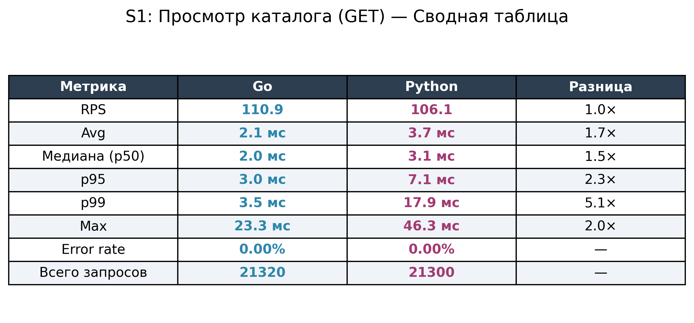
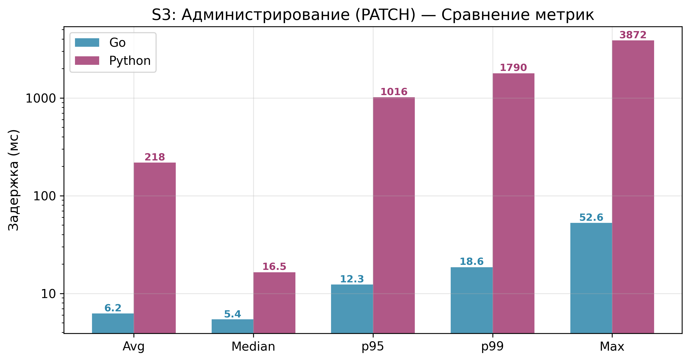
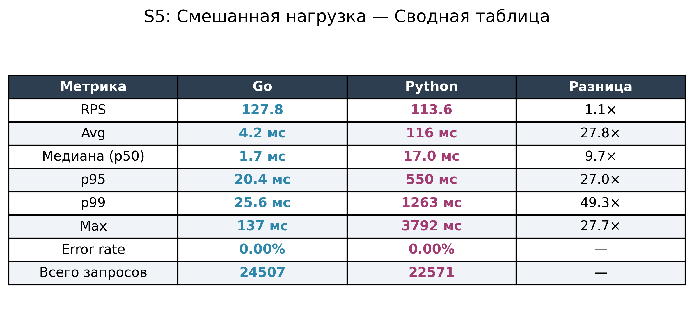

# Сравнительный анализ языков программирования Golang и Python для backend-разработки веб-приложений

> Выпускная квалификационная работа  
> **Выполнила:** Багуманова Аида, группа Р4207  
> **Направление:** Программная инженерия

---

## Описание проекта

Данный репозиторий содержит исходный код и инструментарий экспериментального исследования, проведённого в рамках выпускной квалификационной работы. Целью работы является объективное сравнение производительности двух серверных реализаций идентичного REST API — на языках **Go** и **Python** — при обработке типовых нагрузок, характерных для промышленных веб-приложений.

Для обеспечения чистоты эксперимента оба сервиса реализуют одну и ту же предметную область (интернет-магазин), используют идентичную схему базы данных, развёртываются в контейнерах Docker с одинаковыми ресурсными ограничениями и тестируются едиными сценариями нагрузки.

---

## Обоснование выбора технологического стека

При выборе фреймворков и библиотек основным принципом было обеспечение **паритетности условий** эксперимента. Для каждого языка выбраны инструменты, занимающие аналогичную нишу в экосистеме, чтобы результаты отражали разницу между языками, а не между абстракциями фреймворков.

| Компонент | Go | Python | Обоснование |
|-----------|-----|--------|-------------|
| **HTTP-сервер** | `net/http` (stdlib) | Starlette + Uvicorn | Минималистичные, неопинионированные фреймворки без ORM и магии. Оба предоставляют роутинг и middleware без лишнего overhead |
| **Драйвер БД** | `lib/pq` | `asyncpg` | Нативные PostgreSQL-драйверы без ORM-прослойки. `asyncpg` — самый быстрый асинхронный драйвер для Python |
| **СУБД** | PostgreSQL 15 | PostgreSQL 15 | Единая СУБД с идентичной схемой данных. Каждый сервис получает собственный изолированный экземпляр |
| **Мониторинг** | `prometheus/client_golang` | `prometheus-client` | Стандартные клиенты Prometheus для каждого языка |
| **Контейнеризация** | Docker | Docker | Изоляция среды выполнения с идентичными ресурсными лимитами (4 CPU, 3 GB RAM) |

---

## Тестовая среда

### Оборудование

| Параметр | Значение |
|----------|----------|
| Процессор | AMD Ryzen 7 8845HS |
| Оперативная память | 16 GB DDR5 |
| Контейнеризация | Docker Desktop (WSL2 backend) |
| Сеть | Локальная (localhost / Docker bridge) |

### Ресурсные ограничения контейнеров

Каждому сервису выделены идентичные лимиты, заданные через `docker-compose.yml`:

- **CPU:** 4 ядра
- **RAM:** 3 GB
- **Пул соединений БД:** настраиваемый через переменные окружения

---

## Архитектура решения

Оба сервиса реализуют REST API интернет-магазина со следующими эндпоинтами:

| Метод | Эндпоинт | Описание |
|-------|----------|----------|
| `GET` | `/products` | Получение списка товаров с пагинацией |
| `GET` | `/products/{id}` | Получение товара по идентификатору |
| `POST` | `/products` | Создание нового товара |
| `PATCH` | `/products/{id}` | Обновление параметров товара |
| `DELETE` | `/products/{id}` | Удаление товара |
| `POST` | `/orders` | Создание заказа (транзакция с блокировкой остатков) |
| `GET` | `/orders/{id}` | Получение заказа по идентификатору |
| `GET` | `/health` | Проверка работоспособности сервиса |
| `GET` | `/metrics` | Метрики Prometheus |

Внутренняя архитектура обоих сервисов следует трёхслойной модели:

```
handlers (HTTP) → service (бизнес-логика) → storage (SQL-запросы к PostgreSQL)
```

---

## Структура проекта

```
go-python-backend-comparison/
│
├── golang-service/                 # Реализация на Go
│   ├── Dockerfile
│   ├── go.mod
│   ├── cmd/server/main.go          # Точка входа
│   └── internal/
│       ├── config/                  # Конфигурация из env-переменных
│       ├── handlers/                # HTTP-обработчики (роутинг)
│       ├── service/                 # Бизнес-логика (транзакции)
│       ├── storage/                 # Слой доступа к данным (SQL)
│       ├── middleware/              # Logging, Recovery, Metrics
│       └── metrics/                 # Prometheus-метрики
│
├── python-service/                 # Реализация на Python
│   ├── Dockerfile
│   ├── requirements.txt
│   ├── main.py                     # Точка входа (Uvicorn + Starlette)
│   └── internal/
│       ├── config/                  # Конфигурация из env-переменных
│       ├── handlers/                # HTTP-обработчики
│       ├── service/                 # Бизнес-логика
│       ├── storage/                 # Слой доступа к данным (asyncpg)
│       ├── models/                  # Pydantic-подобные модели
│       ├── middleware/              # Logging, Metrics
│       └── metrics/                 # Prometheus-метрики
│
├── sql/
│   ├── migrations/                 # DDL: создание таблиц, индексов, seed-данных
│   └── seed/                       # Начальное наполнение БД (500 товаров)
│
├── benchmarks/
│   ├── scenarios/                  # Сценарии k6 (JavaScript)
│   │   ├── shared.js               # Общая конфигурация профиля нагрузки
│   │   ├── s1_browsing.js          # S1: Просмотр каталога
│   │   ├── s2_orders.js            # S2: Оформление заказов
│   │   ├── s3_admin.js             # S3: Администрирование
│   │   ├── s4_analytics.js         # S4: Аналитические запросы
│   │   └── s5_mixed.js             # S5: Смешанная нагрузка
│   ├── analyze.py                  # Скрипт анализа и визуализации
│   ├── run_all.ps1                 # Автоматизация прогонов (PowerShell)
│   └── results/
│       └── charts/                 # Графики и CSV-статистики
│
├── docker-compose.yml              # Оркестрация всех сервисов
└── README.md
```

---

## Описание тестовых сценариев

Нагрузочное тестирование проводится с помощью инструмента **[k6](https://k6.io/)** (Grafana Labs). Все сценарии используют единый профиль нагрузки — трёхступенчатую модель с нарастанием числа виртуальных пользователей (VU):

| Этап | Длительность | Виртуальные пользователи | Назначение |
|------|-------------|--------------------------|------------|
| Прогрев (Warm-up) | 30 сек | 0 → 20 | Инициализация пулов соединений |
| Стабильная нагрузка | 30 сек | 20 → 50 | Оценка в штатном режиме |
| Повышенная нагрузка | 1 мин | 50 → 100 | Работа под давлением |
| Стресс-тест | 1 мин | 100 → 500 | Поиск предельной пропускной способности |
| Охлаждение (Cool-down) | 30 сек | 500 → 0 | Корректное завершение |

### Сценарии

| Сценарий | Операции | Описание |
|----------|----------|----------|
| **S1: Browsing** | `GET /products`, `GET /products/{id}` | Имитация просмотра каталога покупателем. Только чтение, лёгкие запросы |
| **S2: Orders** | `POST /orders`, `GET /orders/{id}` | Создание заказов с транзакционной блокировкой остатков. Операции записи |
| **S3: Admin** | `PATCH /products/{id}` | Массовое обновление товаров администратором. UPDATE-нагрузка |
| **S4: Analytics** | `GET /products?limit=50` | Аналитические выборки большого объёма данных |
| **S5: Mixed** | Комбинация S1–S4 | Смешанная нагрузка, приближенная к реальной эксплуатации |

---

## Запуск проекта

### Предварительные требования

- [Docker Desktop](https://www.docker.com/products/docker-desktop/) (с WSL2 на Windows)
- [k6](https://k6.io/docs/get-started/installation/) — инструмент нагрузочного тестирования
- [Python 3.10+](https://www.python.org/) с библиотеками: `polars`, `matplotlib`, `numpy`

### 1. Запуск сервисов

```powershell
# Go-сервис (порт 8080)
docker-compose up -d golang-service

# Python-сервис (порт 8080)
docker-compose up -d python-service
```

> ⚠️ Сервисы используют один и тот же порт 8080, поэтому одновременно может работать только один из них.

### 2. Проверка работоспособности

```powershell
curl http://localhost:8080/health
```

### 3. Полный цикл тестирования

Скрипт `run_all.ps1` автоматизирует весь процесс: запуск сервисов, прогон всех сценариев и генерацию аналитических отчётов.

```powershell
# Тестирование обоих сервисов (последовательно)
.\benchmarks\run_all.ps1

# Только Go
.\benchmarks\run_all.ps1 -Service golang-service

# Только Python
.\benchmarks\run_all.ps1 -Service python-service
```

### 4. Ручной запуск отдельного сценария

```powershell
# Пример: сценарий S1 для Go-сервиса
docker run --rm --network host -v ${PWD}:/app -i grafana/k6 run /app/benchmarks/scenarios/s1_browsing.js --out json=/app/benchmarks/results/s1_browsing_go.json
```

### 5. Генерация аналитических отчётов

```powershell
# Установка зависимостей для анализа
pip install polars matplotlib numpy

# Запуск анализа для всех сценариев
$scenarios = @("s1_browsing", "s2_orders", "s3_admin", "s4_analytics", "s5_mixed")
foreach ($s in $scenarios) {
    if ((Test-Path "benchmarks/results/${s}_go.json") -and (Test-Path "benchmarks/results/${s}_py.json")) {
        python benchmarks/analyze.py --go "benchmarks/results/${s}_go.json" --py "benchmarks/results/${s}_py.json" --name $s
    }
}
```

### 6. Остановка и очистка

```powershell
docker-compose down -v
```

---

## Результаты экспериментов

Для каждого сценария скрипт `analyze.py` генерирует пять типов визуализаций:

1. **Latency over Time** — временной ряд задержки с нормализованным временем
2. **Boxplot** — распределение задержки (медиана, квартили)
3. **Bar Chart** — столбчатое сравнение ключевых метрик
4. **CDF** — кумулятивная функция распределения
5. **Сводная таблица** — Go vs Python с колонкой «Разница»

### Сводные результаты по всем сценариям

| Сценарий | Метрика | Go | Python | Разница |
|----------|---------|-----|--------|---------|
| **S1: Browsing** | Avg | 2.1 мс | 3.7 мс | 1.7× |
| | p99 | 3.5 мс | 17.9 мс | 5.1× |
| **S2: Orders** | Avg | 16.5 мс | 25.9 мс | 1.6× |
| | p99 | 49.5 мс | 315 мс | 6.4× |
| **S3: Admin** | Avg | 6.2 мс | 218 мс | 35× |
| | p99 | 18.6 мс | 1791 мс | 96× |
| **S4: Analytics** | Avg | 3.5 мс | 8.6 мс | 2.5× |
| | p99 | 5.5 мс | 32.8 мс | 6.0× |
| **S5: Mixed** | Avg | 4.2 мс | 116 мс | 27.8× |
| | p99 | 25.6 мс | 1262 мс | 49× |

### Пример графиков

#### S1: Просмотр каталога — сводная таблица


#### S3: Администрирование — сравнение метрик (логарифмическая шкала)


#### S5: Смешанная нагрузка — сводная таблица


---

## Выводы

Проведённое экспериментальное исследование показало, что **Go-реализация стабильно демонстрирует более низкую задержку** по всем перцентилям во всех пяти тестовых сценариях. Наиболее значительная разница наблюдается в сценариях с интенсивными операциями записи (S3, S5), где хвостовая задержка (p99) Go-сервиса оказывается в **50–96 раз ниже**, чем у Python-реализации.

При этом в сценариях с преобладанием операций чтения (S1, S4) разрыв значительно меньше — в пределах **1.5–6×**, что объясняется меньшей ролью конкурентной модели при обработке простых SELECT-запросов.

Полные результаты, графики и CSV-статистики доступны в директории `benchmarks/results/charts/`.

---

## Лицензия

Данный проект разработан в учебных целях в рамках выпускной квалификационной работы.
